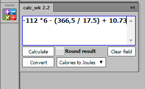
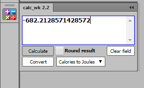
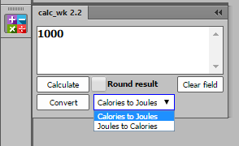
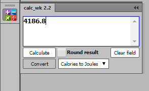

**`Eng`**
#extension panel for Adobe CC+ Illustrator, InDesign and Photoshop 
##description:
The most super-simple calculator that based on the js function eval
    
**`Rus`**
#Панель расширения для Adobe CC+ Illustrator, InDesign и Photoshop
##Описание:
* Простейший строковый калькулятор на основе JavaScript функции [eval](http://learn.javascript.ru/eval)
##Использование:
* Напечатайте математическое выражение и нажмите `Calculate` 
Например, выражение -112 *6 - (366,5 / 17.5) + 10.73 
в результате даст -682.2128571428572
* Для перевода Джоулей в Калории и обратно:
    01. из выпадающего списка выбрать соответствующую операцию
    02. введите число и нажмите `Convert`
##Допустимые символы:
* Цифры
* Десятичная точка или запятая
* Знаки математических операций `+`, `-`, `*`, `\`
* Методы JavaScript объекта [Math](http://javascript.ru/Math)
##Найденные ошибки:
* Автоисправление (на этапе вычисления) запятой на точку 
не позволяет использовать функции объекта [Math](http://javascript.ru/Math), 
где аргументы разделяются запятой, например `Math.pow(x, y)` или `Math.max(a,b,c,d,...,z)`

 

 

